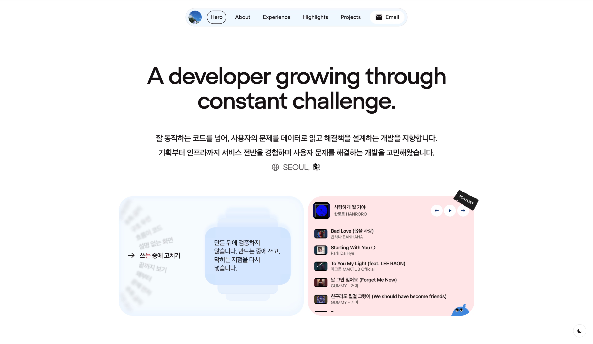

<div align="center">



<br/>

<h1>Leehyeon Shin</h1>

<p>잘 동작하는 코드를 넘어, 사용자의 문제를 데이터로 읽고 해결책을 설계합니다.</p>

<p>
  
  
  
  
</p>

</div>

---

## 프로젝트 구조

```
portfolio-site/
├─ app/             # Next.js App Router · 케이스 스터디 라우트
├─ features/        # 홈 · 플레이어 · 케이스 스터디
├─ shared/          # 공통 UI · 스타일 · 트래킹
└─ public/          # 이미지 · 폰트
```
